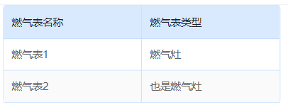

### 封装的uni-table


### 使用
```html
<Table
    :columnDes="['燃气表名称', '燃气表类型']"
    :columnFields="['name', 'type']"
    :tableList="tableList"
    :valueDesMapOfFields="valueDesMapOfFields"
/>
```
```javascript
const tableList={name:'燃气表1',type:0}
const valueDesMapOfFields={ 
    type: {
        0:'燃气灶',
        1:'也是燃气灶'
    }
}
```